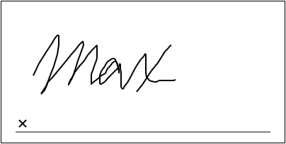
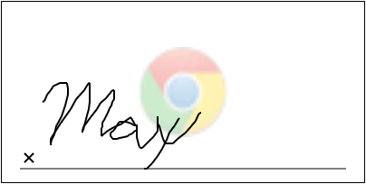
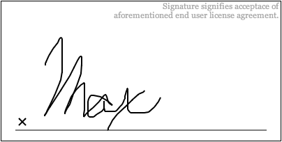
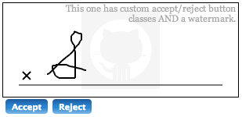

## Signature.js

Super lightweight (~8kb minified), self-contained (no libraries), HTML 5 & Javascript signature capture tool.

### Examples

[here](http://maxwells.github.io/signature.js)

### Features

- Watermarking
- Saving images as PNG (with proper backend)
- Supports multiple signature captures on a single page
- Explanation text
- Saving png to server
- Supports
	- Desktop
		- Chrome
		- Safari
		- FireFox
	- iOS
		- Safari
		- Chrome
  - todo: more testing

### Pipeline

- export as SVG
- export as JSON vectors

### Usage

The following HTML and CSS snippets hold true for the following example usages

```css
#my-signature-div { width: 400px; height: 200px; border: thin solid black; }
```
```html
<div id="my-signature-div"></div>
```

**Basic**

```javascript
var signature = new Signature({ displayId: 'my-signature-div' });
```



**Watermark**

```javascript
var signature = new Signature({
	displayId: 'my-signature-div',
	watermark: {
		url: 'img/github.png',
		position: Signature.CENTER, // any cardinal/ordinal direction or CENTER (defaults to NORTH)
		alpha: 0.2, // 0-1, representing transparency (default: 0.2)
		width: 100, // width of displayed watermark
		height: 100 // height of displayed watermark
	}
});
```


**Explanation Text**

```javascript
var signature = new Signature( {
	displayId: 'my-signature-div',
	explanation: {
		text: "Signature signifies acceptace of aforementioned end user license agreement.", // set text for explanation
		font: "georgia", // choose a font (defaults to sans-serif)
		color: "#aaa", // defaults to #000
		size: 12, // defaults to 10 point
		lineHeight: 13, // defaults to 1.2em
		maxWidth: 150, // defaults to entire width
		position: Signature.NORTH_EAST // any cardinal/ordinal direction or CENTER (defaults to NORTH)
	}
});
```


**Saving**

Either use the built in XMLHttpRequest/ActiveXObject("Microsoft.XMLHTTP") handling or provide your own

Built in handling

```javascript
var signature4 = new Signature({
  displayId: 'my-signature-div',
  explanation: {
    text: "This one saves.",
    font: "georgia",
    color: "#aaa",
    size: 12,
    lineHeight: 13,
    maxWidth: 250,
    position: Signature.NORTH_EAST
  },
  http: {
    verb: "POST", // choose a verb. GET will only work for tiny requests. (defaults to POST)
    address: "http://localhost:3000/images", // your backend address to handle image processing.
    dataParam: 'data', // the parameter your backend image processor will take
    onSave: function(response) { alert(response.status); } // handle the http response (eg. notify the user that the save was successful, if it was)
  }
});
```

Custom handling

```javascript
var signature = new Signature( {
  displayId: 'my-signature-div',
  explanation: {
    text: "This one saves the way I want it to.",
    font: "georgia",
    color: "#aaa",
    size: 12,
    lineHeight: 13,
    maxWidth: 250,
    position: Signature.NORTH_EAST
  },
  save: function(data) {
    $.post('/images', {data: data}, function(response) { alert("Thank you for submitting your signature!"); });
  }
});
```
For both of these examples, I used a pretty basic rails action. Note that the png data is base 64 encoded, so you'll need to decode it before attempting to save it.

```ruby
class ImagesController < ActionController::Base
  def save
    data = params[:data].gsub(/ /, '+') # pluses have been converted to spaces -> convert them back
    File.open('image.png', 'wb') do|f|
      f.write(Base64.decode64(data))
    end
    render :json => {:status => true}, :layout => false
  end
end
```

This is an image dumped through a basic rails server (200x120). Note that it includes the output of the canvas (ie. explanation and watermark, if applicable).


### Styling

Currently, the only styling available beyond explanation text (see Usage#explanation-text above) is the accept/reject buttons. They are standard button elements that are added to the container div. The class attached to them is settable

```javascript
var signature5 = new Signature( {
  displayId: 'display6',
  watermark: {
    url: 'img/github.png',
    position: Signature.CENTER,
    alpha: 0.2,
    width: 100,
    height: 100
  },
  explanation: {
    text: "This one has custom accept/reject button classes AND a watermark.",
    font: "georgia",
    color: "#aaa",
    size: 12,
    lineHeight: 13,
    maxWidth: 250,
    position: Signature.NORTH_EAST
  },
  buttonClass: "my-button-class"
});
```




### MIT License